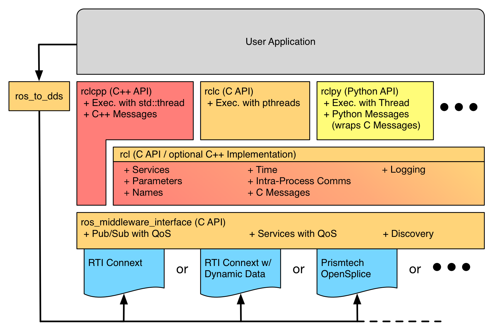
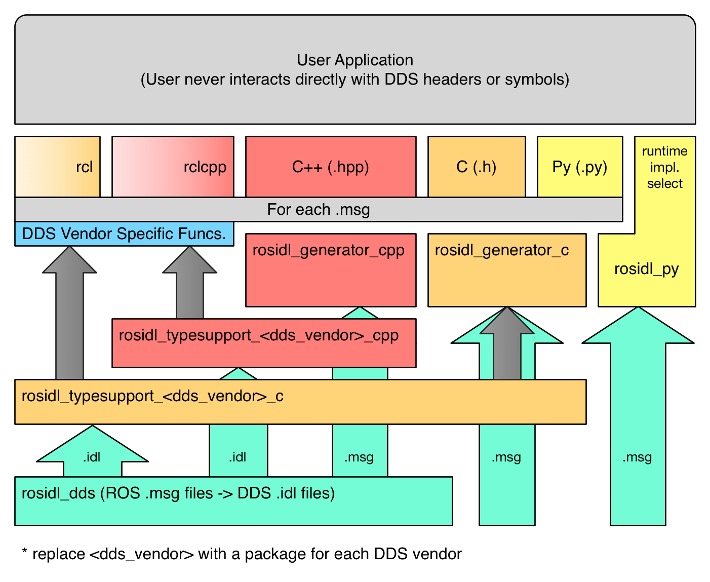

Core Stack Developer Overview
=============================

.. include:: global_substitutions.txt

The ROS 2 core software stack breaks down into a few discrete but related parts:

.. toctree::
   :hidden:

   glossary.rst

.. contents::
   :depth: 2
   :local:

When reading this document, references to an interface or an |API| generally imply they are manifested as a set of headers which are installed, public, and change controlled.
Also, when reference to an implementation is made that generally implies one to many sets of source files, e.g. ``.c`` or ``.cpp``, which implement one of the described |APIs|.

.. _build_system:

Build System
------------

Under everything is the build system.
Iterating on ``catkin`` from ROS 1 we have created a set of |packages| under the moniker ``ament``.
Some of the reasons for changing the name to ``ament`` are that we wanted it to not collide with ``catkin`` (in case we want mix them at some point) and to prevent confusion with existing ``catkin`` documentation.
``ament``'s primary responsibility is to make it easier to develop and maintain ROS 2 core |packages|.
However, this responsibility extends to any user who is willing to make use of our build system conventions and tools.
Additionally it should make |packages| conventional, such that developers should be able to pick up any ``ament`` based |package| and make some assumptions about how it works, how to introspect it, and how to build or use it.

``ament`` consists of a few important repositories which are all in the ``ament`` |GitHub|_ organization:

.. contents::
   :depth: 1
   :local:

The ``ament_package`` Package
~~~~~~~~~~~~~~~~~~~~~~~~~~~~~

Located on |GitHub|_ at `ament/ament_package <https://github.com/ament/ament_package>`_, this repository contains a single :term:`ament Python package` which provides a Python |API| for finding and parsing :term:`package.xml` files.

All |ament packages| must contain a single :term:`package.xml` file at the root of the package regardless of their underlying build system.
The :term:`package.xml` "manifest" file contains information required to process and operate on a |package|.
This |package| information includes things like the |package|'s name which is globally unique and the package's dependencies.
The :term:`package.xml` file also serves as the marker file which indicates the location of the |package| on the file system.

Other than parsing the :term:`package.xml` files, ``ament_package`` provides functionality to locate |packages| by searching the file system for these :term:`package.xml` files.

.. glossary::

   package.xml
       Package manifest file which marks the root of a :term:`package` and contains meta information about the :term:`package` including its name, version, description, maintainer, license, dependencies, and more.
       The contents of the manifest are in machine readable XML format and the contents are described in the |REPs| `127 <http://www.ros.org/reps/rep-0127.html>`_ and `140 <http://www.ros.org/reps/rep-0140.html>`_, with the possibility of further modifications in future |REPs|.

So anytime some |package| is referred to as an :term:`ament package`, it means that it is a single unit of software (source code, build files, tests, documentation, and other resources) which is described using a :term:`package.xml` manifest file.

.. glossary::

   ament package
       Any |package| which contains a :term:`package.xml` and follows the packaging guidelines of ``ament``, regardless of the underlying build system.

Since the term :term:`ament package` is build system agnostic, there can be different kinds of |ament packages|, e.g. :term:`ament CMake package`, :term:`ament Python package`, etc., but all of them have at least a :term:`package.xml` file to document their details in a machine readable manner.

Here is a list of common package types that you might run into in this software stack:

.. glossary::

    CMake package
        Any |package| containing a plain CMake project and a :term:`package.xml` manifest file.

    ament CMake package
        A :term:`CMake package` that also follows the ``ament`` packaging guidelines.

    Python package
        Any |package| containing a `setuptools <http://pythonhosted.org/setuptools/>`_ based Python project and a :term:`package.xml` manifest file.

    ament Python package
        A :term:`Python package` that also follows the ``ament`` packaging guidelines.

The ``ament_cmake`` Repository
~~~~~~~~~~~~~~~~~~~~~~~~~~~~~~

Located on |GitHub|_ at `ament/ament_cmake <https://github.com/ament/ament_cmake>`_, this repository contains many "ament CMake" and pure CMake packages which provide the infrastructure in CMake that is required to create "ament CMake" packages.
In this context "ament CMake" packages means: ``ament`` packages that are built using CMake.
So the |packages| in this repository provide the necessary CMake functions/macros and CMake Modules to facilitate creating more "ament CMake" (or ``ament_cmake``) packages.
Packages of this type are identified with the ``<build_type>ament_cmake</build_type>`` tag in the ``<export>`` tag of the :term:`package.xml` file.

The |packages| in this repository are extremely modular, but there is a single "bottleneck" |package| called ``ament_cmake``.
Anyone can depend on the ``ament_cmake`` |package| to get all of the aggregate functionality of the |packages| in this repository.
Here a list of the |packages| in the repository along with a short description:

-  ``ament_cmake``

   - aggregates all other |packages| in this repository, users need only to depend on this.

-  ``ament_cmake_auto``

   - provides convenience CMake functions which automatically handle a lot of the tedious parts of writing a |package|'s ``CMakeLists.txt`` file

-  ``ament_cmake_core``

   - provides all built-in core concepts for ``ament``, e.g. environment hooks, resource indexing, symbolic linking install and others

-  ``ament_cmake_gmock``

   - adds convenience functions for making gmock based unit tests

-  ``ament_cmake_gtest``

   - adds convenience functions for making gtest based automated tests

-  ``ament_cmake_nose``

   - adds convenience functions for making nosetests based python automated tests

-  ``ament_cmake_python``

   - provides CMake functions for |packages| that contain Python code

-  ``ament_cmake_test``

   - aggregates different kinds of tests, e.g. gtest and nosetests, under a single target using CTest

The ``ament_cmake_core`` |package| contains a lot of the CMake infrastructure that makes it possible to cleanly pass information between |packages| using conventional interfaces.
This makes the |packages| have more decoupled build interfaces with other |packages|, promoting their reuse and encouraging conventions in the build systems of different |packages|.
For instance it provides a standard way to pass include directories, libraries, definitions, and dependencies between |packages| so that consumers of this information can access this information in a conventional way.

The ``ament_cmake_core`` |package| also provides features of the ``ament`` build system like symbolic link installation, which allows you to symbolically link files from either the source space or the build space into the install space rather than copying them.
This allows you to install once and then edit non-generated resources like Python code and configuration files without having to rerun the install step for them to take effect.
This feature essentially replaces the "devel space" from ``catkin`` because it has most of the advantages with few of the complications or drawbacks.

Another feature provided by ``ament_cmake_core`` is the |package| resource indexing which is a way for |packages| to indicate that they contain a resource of some type.
The design of this feature makes it much more efficient to answer simple questions like what |packages| are in this prefix (e.g. ``/usr/local``) because it only requires that you list the files in a single possible location under that prefix.
You can read more about this feature in the `design docs <https://github.com/ament/ament_cmake/blob/master/ament_cmake_core/doc/resource_index.md>`_ for the resource index.

Like ``catkin``, ``ament_cmake_core`` also provides environment setup files and |package| specific environment hooks.
The environment setup files, often named something like ``setup.bash``, are a place for |package| developers to define changes to the environment that are needed to utilize their |package|.
The developers are able to do this using an "environment hook" which is basically an arbitrary bit of shell code that can set or modify environment variables, define shell functions, setup auto-completion rules, etc...
This feature is how, for example, ROS 1 set the ``ROS_DISTRO`` environment variable without ``catkin`` knowing anything about the ROS distribution.

The ``ament_lint`` Repository
~~~~~~~~~~~~~~~~~~~~~~~~~~~~~

Located on |GitHub|_ at `ament/ament_lint <https://github.com/ament/ament_lint>`_, this repository provides several |packages| which provide linting and testing services in a convenient and consistent manner.
Currently there are |packages| to support using ``clang_format``, using ``cppcheck``, checking for copyright in source code, using ``pep8``, and other things but the list should grow in the future.

The ``ament_tools`` Package
~~~~~~~~~~~~~~~~~~~~~~~~~~~

Located on |GitHub|_ at `ament/ament_tools <https://github.com/ament/ament_tools>`_, this repository provides a single ament Python package which provides command line tools for working with |ament packages|.
Like ``catkin_tools`` it provides a lot of its functionality in the ``ament build`` command, which can build a workspace of ``ament`` packages together at once.

Because ``ament_tools`` and ``ament_package`` are ament Python packages, they can be bootstrapped in an ament workspace just like any other |package|.

ROS Implementation Interfaces
-----------------------------

ROS implementation interfaces are public C |APIs| that are not directly used by the typical ROS user, but instead are used to implement |client libraries|.
The ROS |client libraries| provide the user facing |APIs| that most ROS users are used to seeing, perhaps in a variety of programming languages.

There are two main implementation interfaces: the ROS middleware interface (``rmw`` |API|) and the ROS |client library| interface (``rcl`` |API|).
The ``rmw`` |API| is the main point at which the ROS 2 software stack touches the middleware implementation.
The middleware used for ROS 2 is DDS, and a middleware implementation is one of the DDS vendors.
The ``rcl`` |API| is a slightly higher level |API| which is used to implement the |client libraries| and does not touch the middleware implementation directly.

In addition to these two static |APIs| there is the ``rosidl`` |API|, which is more complicated because it is usually generated for each message and because it can be exposed directly to users.
The ``rosidl`` *interface* simply defines what code is to be generated for messages in each programming language that has a |client library|, while the ``rosidl`` *implementation* contains the code for generating that code, i.e. converting ROS message types to and from native types for the middleware implementation (vendor specific DDS types).
The ``rosidl`` C implementation can be reused by other languages that can interface with C, e.g. Python.

As the diagram shows, these |APIs| are stacked such that the ROS developer uses the client library |API|, e.g. ``rclcpp``, to write the implementation of their code (executable or library).
The implementation of the client library, e.g. ``rclcpp``, then uses both the ``rcl`` and the ``rosidl`` interfaces, for providing access to the ROS graph and for communicating with other nodes through standardized ROS messages, respectively.
The ``rcl`` implementation is provided by the ``rcl`` |package| and uses the ``rmw`` |API| to implement itself, leaving parts unimplemented where message type specific code is required.
Then the ``rosidl`` implementation implements symbols from both the generated headers and some type specific functions in the ``rcl`` and ``rmw`` interfaces that were left unimplemented.
The actual library that contains this implementation is provided by |packages| with messages in them, e.g. ``geometry_msgs``, but the code in those libraries is indirectly provided by a language specific ``rosidl`` |package| that generates the code, e.g. ``rosidl_generator_cpp``.
Finally, the implementation of the ``rmw`` |API| is provided by a middleware implementation specific |package|, e.g. ``rmw_opensplice``, the library of which is compiled against vendor specific DDS interfaces and types.

All along the way there are some functions that are necessarily message type specific and require code generated for each message.
The following diagram layouts the stack of software that results in the generated message code to support the ``rcl`` and ``rmw`` |APIs|:

The ``rmw`` interface acts as a boundary between middleware implementation details and the rest of the ROS code base.
This boundary can also serve as a stable ABI, allowing for easily switching between vendors at runtime by swapping out shared libraries.
However, if the format being used for exchanging messages "on the wire" is specific to the middleware, there may still be vendor specific code in message packages, in which case libraries must also be swapped in message packages in order to effectively change vendors.

Putting it all together, a user's executable will be a combination of their object files, e.g. ``main.o``, the ``rcl`` shared object, e.g. ``librcl.so``, some shared objects which are specific to message and type support pairs, e.g. ``libgeometry_msgs.so`` -> ``libgeometry_msgs__rosidl_typesupport_introspection_cpp.so``, and the middleware implementation's shared object, e.g. ``librmw.so`` -> ``librmw__fastrtps_cpp.so``.

The ``rcl`` Repository
~~~~~~~~~~~~~~~~~~~~~~

The ROS Client Library interface (``rcl`` |API|) can be used by |client libraries| (e.g. ``rclc``, ``rclcpp``, ``rclpy``, etc.) in order to avoid duplicating logic and features.
By reusing the ``rcl`` |API|, client libraries can be smaller and more consistent with each other.
Some parts of the client library are intentionally left out of the ``rcl`` |API| because the language idiomatic method should be used to implement those parts of the system.
A good example of this is the execution model, which ``rcl`` does not address at all.
Instead the client library should provide a language idiomatic solution like ``pthreads`` in C, ``std::thread`` in C++11, and ``threading.Thread`` in Python.
Generally the ``rcl`` interface provides functions that are not specific to a language pattern and are not specific to a particular message type.

The ``rcl`` |API| is located in the `ros2/rcl <https://github.com/ros2/rcl>`_ repository on |GitHub|_ and contains the interface as C headers.
The ``rcl`` C implementation is provided by the ``rcl`` |package| in the same repository. 
This implementation avoids direct contact with the middleware and message representation format by instead using the ``rmw`` and ``rosidl`` |APIs|, respectively.

For a complete definition of the ``rcl`` |API|, see the |API| documentation:

.. warning::

    TODO: Link to ``rcl`` |API| docs

The ``rmw`` Repository
~~~~~~~~~~~~~~~~~~~~~~

The ROS middleware interface (``rmw`` |API|) is the minimal set of primitive middleware capabilities needed to build ROS on top.
Providers of different middleware implementations must implement this interface in order to support the entire ROS stack on top.
Currently all of the middleware implementations are for different DDS vendors.

The ``rmw`` |API| is located in the `ros2/rmw <https://github.com/ros2/rmw>`_ repository.
The ``rmw`` |package| contains the C headers which define the interface, the implementation of which is provided by the various |packages| of rmw implementations for different DDS vendors.

For a definition of the ``rmw`` |API|, see the |API| docs:

.. warning::

    TODO: Link to the ``rmw`` |API| docs

The ``rosidl`` Repository
~~~~~~~~~~~~~~~~~~~~~~~~~

The ``rosidl`` |API| consists of a few message related static functions and types along with a definition of what code should be generated by messages in different languages.
The generated message code specified in the |API| will be language specific, but may or may not reuse generated code for other languages.
The generated message code specified in the |API| contains things like the message data structure, functions for construction, destruction, etc.
In addition to the generated message code specified in the ``rosidl`` |API|, there is generated message code for the implementation of other parts of the system, e.g. for functions in the ``rmw`` |API| and the ``rcl`` |API|, but the generation of this kind of code is done mostly in middleware implementation specific |packages|.

There are several repositories that play a role in the ``rosidl`` |API| and implementation.

The ``rosidl`` repository, located on |GitHub|_ at `ros2/rosidl <https://github.com/ros2/rosidl>`_, defines the message IDL syntax, i.e. syntax of ``.msg`` files, ``.srv`` files, etc., and contains |packages| for parsing the files, for providing CMake infrastructure to generate code from the messages, for generating implementation agnostic code (headers and source files), and for establishing the default set of generators.
The repository contains these |packages|:

-  ``rosidl_cmake``: provides CMake functions and Modules for generating code from ``rosidl`` files, e.g. ``.msg`` files, ``.srv`` files, etc.
-  ``rosidl_default_generators``: defines the list of default generators which ensures that they are installed as dependencies, but other injected generators can also be used.
-  ``rosidl_generator_c``: provides tools to generate C header files (``.h``) for ``rosidl`` files.
-  ``rosidl_generator_cpp``: provides tools to generate C++ header files (``.hpp``) for ``rosidl`` files.
-  ``rosidl_generator_py``: provides tools to generate Python modules for ``rosidl`` files.
-  ``rosidl_parser``: provides Python |API| for parsing ``rosidl`` files.

Generators for other languages, e.g. ``rosidl_generator_java``, are hosted externally (in different repositories) but would use the same mechanism that the above generators use to "register" themselves as a ``rosidl`` generator.

In addition to the aforementioned |packages| for parsing and generating headers for the ``rosidl`` files, the ``rosidl`` repository also contains |packages| concerned with "type support" for the message types defined in the files.
Type support refers to the ability to interpret and manipulate the information represented by ROS message instances of particular types (publishing the messages, for example).
Type support can either be provided by code that is generated at compile time or it can be done programmatically based on the contents of the ``rosidl`` file, e.g. the ``.msg`` or ``.srv`` file, and the data received, by introspecting the data.
In the case of the latter, where type support is done through runtime interpretation of the messages, the message code generated by ROS 2 can be agnostic to the rmw implementation.
The packages that provide this type support through introspection of the data are:

-  ``rosidl_typesupport_introspection_c``: provides tools for dynamically generating C code for supporting ``rosidl`` message data types.
-  ``rosidl_typesupport_introspection_cpp``: provides tools for dynamically generating C++ code for supporting ``rosidl`` message data types.

In the case where type support is to be generated at compile time instead of being generated programmatically, a package specific to the rmw implementation will need to be used.
This is because typically a particular rmw implementation will require data to be stored and manipulated in a manner that is specific to the DDS vendor in order for the DDS implementation to make use of it.

The message code generated using type support introspection has the benefit that message code does not need to be generated beforehand.
This ability comes at a runtime cost though since the messages are programmatically accessed rather than being represented in a data structure.
Also, not all DDS vendors support dynamic interpretation of messages, and making use of the type support introspection is curently optional for DDS based ROS middleware implementations.
However, if multiple rmw implementations support this method of type support, since the message code generated is agnostic to the rmw implementation, in order to change the rmw implementation the only library that would need to be swapped out would be ``librmw.so``, and not the shared libraries for the type support specific to the rmw implementation.

For more information on what exactly is in the ``rosidl`` |API| (static and generated) see this page:

.. warning::

    TODO: link to definition of ``rosidl`` |APIs|

ROS Implementations
-------------------

ROS Implementations are sets of |packages| that implement some of the ROS Implementation interfaces, e.g. the ``rmw``, ``rcl``, ``rosidl`` |APIs|.

Common Packages for DDS Middleware Packages
~~~~~~~~~~~~~~~~~~~~~~~~~~~~~~~~~~~~~~~~~~~

For the purposes of this document, all of the variations on the middleware implementation will be different DDS implementations.
For example, there is a middleware implementation that uses RTI's Connext DDS and an implementation which uses PrismTech's OpenSplice DDS.

For each middleware implementation there will be a set of |packages|, but there are also some |packages| that are shared by all DDS based middleware implementations.

In the `ros2/rosidl_dds <https://github.com/ros2/rosidl_dds>`_ repository on |GitHub|_, there is the following |package|:

-  ``rosidl_generator_dds_idl``: provides tools to generate DDS ``.idl`` files from ``rosidl`` files, e.g. ``.msg`` files, ``.srv`` files, etc.

The ``rosidl_generator_dds_idl`` |package| generates a DDS ``.idl`` file for each ``rosidl`` file, e.g. ``.msg`` file, defined by |packages| containing messages.
Currently DDS based ROS middleware implementations make use of this generator's output ``.idl`` files to generate pre-compiled type support that is vendor specific.

ROS Middleware Implementations
~~~~~~~~~~~~~~~~~~~~~~~~~~~~~~

A ROS middleware implementation is typically made up of a few |packages| in a single repository:

-  ``<implementation_name>_cmake_module``: contains CMake Module for discovering and exposing required dependencies.
-  ``rmw_<implementation_name>_<language>``: contains the implementation of the ``rmw`` |API| in a particular language, typically C++.
-  ``rosidl_typesupport_<implementation_name>_<language>``: contains tools to generate DDS interoperability code for ``rosidl`` files for the implementation in a particular language, typically C or C++.

The ``<implementation_name>_cmake_module`` |package| contains any CMake Modules and functions needed to find the supporting dependencies for the middleware implementation.
In the case of ``opensplice_cmake_module`` it has CMake Modules for finding the OpenSplice implementation in different places on the system since OpenSplice does not ship with a CMake Module itself.

The ``rmw_<implementation_name>_<language>`` |package| implements the ``rmw`` C |API| in a particular language.
The implementation itself can be C++, it just must expose the header's symbols as ``extern "C"`` so that C applications can link against it.

The ``rosidl_typesupport_<implementation_name>_<language>`` |package| provides a generator which generates DDS code in a particular language.
This is done using the ``.idl`` files generated by the ``rosidl_generator_dds_idl`` |package| and the DDS IDL code generator provided by the DDS vendor.
It also generates code for converting ROS message structures to and from DDS message structures.
This generator is also responsible for creating a shared library for the message package it is being used in, which is specific to the messages in the message package and to the DDS vendor being used.

As mentioned above, the ``rosidl_typesupport_introspection_<language>`` may be used instead of a vendor specific type support package if an rmw implementation supports runtime interpretation of messages.
This ability to programmatically send and receive types over topics without generating code beforehand is achieved by supporting the `DDS X-Types Dynamic Data standard <http://www.omg.org/spec/DDS-XTypes>`_.
As such, rmw implementations may provide support for the X-Types standard, and/or provide a package for type support generated at compile time specific to their DDS implementation.

As an example of an rmw implementation repository, the ``opensplice`` ROS middleware implementation lives on |GitHub|_ at `ros2/rmw_opensplice <https://github.com/ros2/rmw_opensplice>`_ and has these |packages|:

-  ``opensplice_cmake_module``
-  ``rmw_opensplice_cpp``
-  ``rosidl_typesupport_opensplice_c``
-  ``rosidl_typesupport_opensplice_cpp``

In addition to the ``opensplice`` repository of |packages|, there is the ``connext`` implementation on |GitHub|_ at `ros2/rmw_connext <https://github.com/ros2/rmw_connext>`_.
It contains mostly the same |packages|, but it additionally contains a |package| to support the type support introspection using the DDS X-Types standard.

The rmw implementation using ``FastRTPS`` is on |GitHub|_ at `eProsima/ROS-RMW-Fast-RTPS-cpp <https://github.com/eProsima/ROS-RMW-Fast-RTPS-cpp>`_.
As ``FastRTPS`` currently only supports the type support introspection, there is no vendor specific type support package in this repository.

To learn more about what is required to create a new middleware implementation for ROS see this page:

.. warning::

    TODO: Link to more detailed middleware implementation docs and/or tutorial.

ROS Client Interfaces (Client Libraries)
----------------------------------------

ROS Client Interfaces, a.k.a. |client libraries|, are user facing interfaces which provide the high level functionality and are built on top of the ``rcl`` and ``rosidl`` |APIs|.

The ``rclc`` Package
~~~~~~~~~~~~~~~~~~~~

The ROS Client Library for C (``rclc``) is the user facing C idiomatic interface which provides all of the ROS client functionality like creating nodes, publisher, and subscribers.
This |API| uses the ``rcl`` |API| and the ``rosidl`` |API| to implement its functions.
Because both ``rcl`` and ``rclc`` are written in C, you might wonder what the difference is between the two |APIs|.
The ``rcl`` |API| provides functions for things like creating nodes, publishers, and subscribers, which are exposed through to the ``rclc`` |API|, but the ``rclc`` |API| additionally handles things like the threading model, configuration, and other components of the client library which are solved differently in different languages.
Since ``rcl`` and ``rclc`` are so similar to each other, ``rclc`` essential can be described as ``rcl`` plus execution (threading).
However, the distinction becomes clearer when you consider client libraries in different languages.

The ``rclc`` repository is located on |GitHub|_ at `ros2/rclc <https://github.com/ros2/rclc>`_ and contains the |package| ``rcl`` which contains the development resources, interface and reference implementation that is required at runtime.

.. warning::

    TODO: Link to the ``rclc`` |API| docs

The ``rclcpp`` Package
~~~~~~~~~~~~~~~~~~~~~~

The ROS Client Library for C++ (``rclcpp``) is the C++ counterpart to the ``rclc`` |API|.
Like ``rclc``, ``rclcpp`` builds on top of ``rcl`` and the ``rosidl`` |API|, though it uses the C++ messages generated by ``rosidl_generator_cpp`` rather than the C message headers generated by ``rosidl_generator_c``.
However, the difference between ``rclcpp`` and ``rcl`` are greater than the differences between ``rclc`` and ``rcl``.
As an example, both ``rcl`` and ``rclc`` return a structure when creating a node, but ``rclcpp`` will return a class or a shared pointer to a class to represent the newly created node, even though it builds on top of ``rcl``.
These kinds of differences in the |API| provide a more natural feel for developers used to the language in question.

``rclcpp`` makes use of all the features of C++ and C++11 to make the interface as easy to use as possible, but since it reuses the implementation in ``rcl`` it is able maintain a consistent behavior with the other client libraries that use the ``rcl`` |API|.

The ``rclcpp`` repository is located on |GitHub|_ at `ros2/rclcpp <https://github.com/ros2/rclcpp>`_ and contains the |package| ``rclcpp``.

.. warning::

    TODO: Link to the ``rclcpp`` |API| docs

The ``rclpy`` Repositories
~~~~~~~~~~~~~~~~~~~~~~~~~~

The ROS Client Library for Python (``rclpy``) is the Python counterpart to the C and C++ client libraries.
Like the C and C++ client libraries, ``rclpy`` also builds on top of the ``rcl`` C API for its implementation.
The interface provides an idiomatic Python experience which uses native Python types and patterns like lists and context objects, but by using the ``rcl`` |API| in the implementation it stays consistent with the other client libraries in terms of feature parity and behavior.
In addition to providing Python idiomatic bindings around the ``rcl`` |API| and Python classes for each message, the Python client library takes care of the execution model, using ``threading.Thread`` or similar to run the functions in the ``rcl`` |API|.

Like C++ it generates custom Python code for each ROS message that the user interacts with, but unlike C++ it eventually converts the native Python message object into the C version of the message.
All operations happen on the Python version of the messages until they need to be passed into the ``rcl`` layer, at which point they are converted into the plain C version of the message so it can be passed into the ``rcl`` C |API|.
This is avoided if possible when communicating between publishers and subscribers in the same process to cut down on the conversion into and out of Python.

The ``rclpy`` repository is located on |GitHub|_ at `ros2/rclpy <https://github.com/ros2/rclpy>`_ and contains the |package| ``rclpy``.

.. warning::

    TODO: Link to the ``rclpy`` |API| docs.
